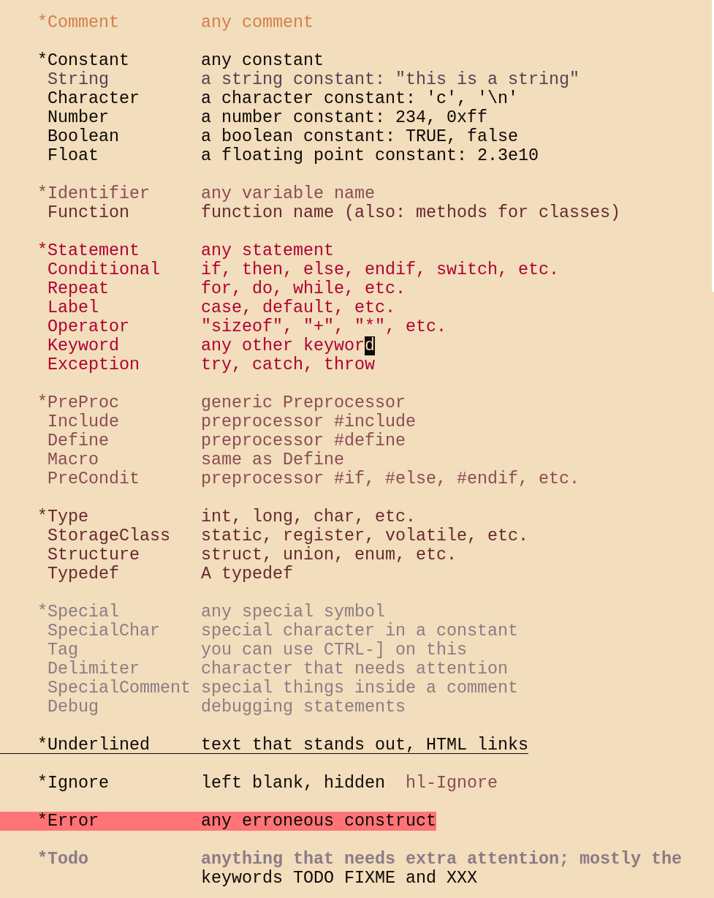
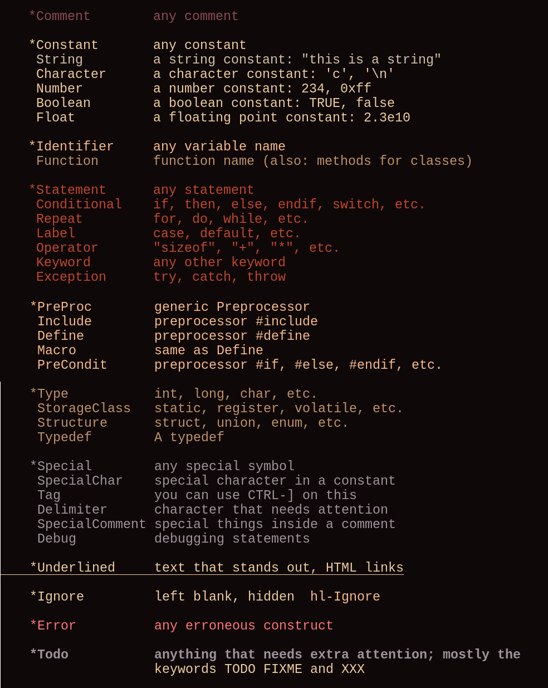
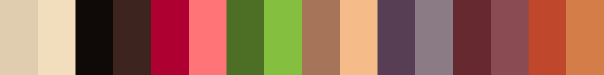
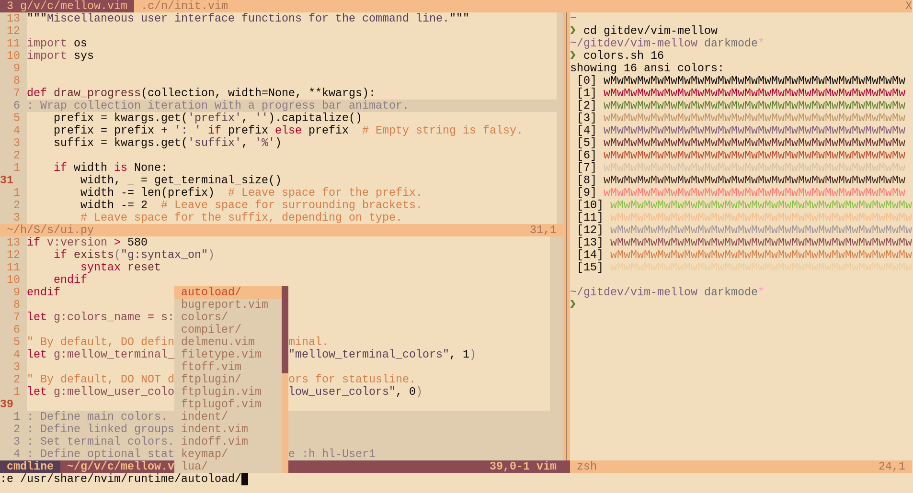
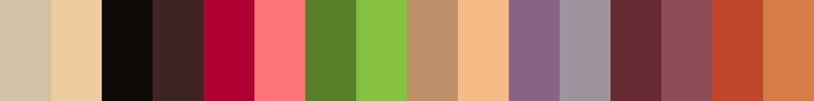
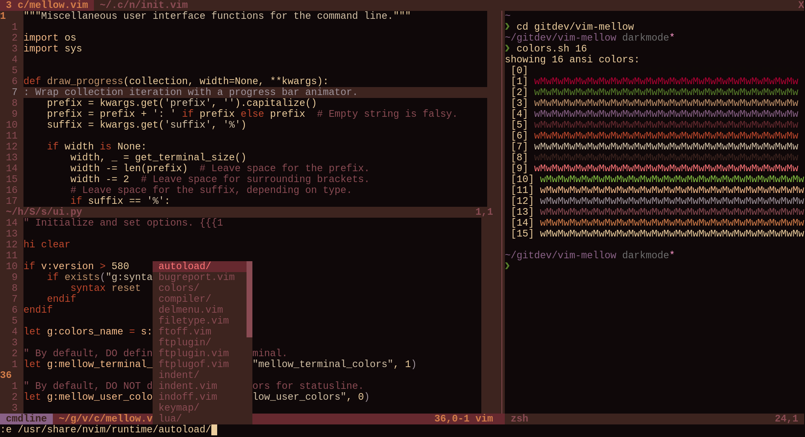

# Mellow

### A warm, minimalist colorscheme for (neo)vim

`Plug 'adigitoleo/vim-mellow'`

**Note for terminal users:** This theme requires 24-bit RGB color support. If
your terminal is [compatible], enable RGB colors via `:set termguicolors`


<!-- vim-markdown-toc GFM -->

* [Screenshots](#screenshots)
* [Light mode](#light-mode)
* [Dark mode](#dark-mode)
* [Installation](#installation)
* [Usage](#usage)
* [Options](#options)
* [Customization](#customization)
* [Miscellaneous](#miscellaneous)

<!-- vim-markdown-toc -->


## Screenshots

Taken on alacritty with LiberationMono font:

<p align="center" style="margin: 4%;">
    
    
</p>

*Do you want a statusline as well? Try the [mellow statusline]!*

### Light mode





### Dark mode






## Installation

If you use a vim plugin manager (recommended), consult the relevant
documentation. Here are some links to popular plugin managers:
- [Pathogen]
- [NeoBundle]
- [Vundle]
- [vim-plug]

For manual installation, download the files from GitHub and put the `colors`
folder inside:
- `~/.vim/` (vim users)
- `~/.config/nvim/` (neovim users)


## Usage

*To apply commands at startup, add them to the end of your configuration file
(see `:help vimrc`).*

You can omit the `termguicolors` part if you are running (neo)vim in a GUI:

```vim
:set termguicolors
:colorscheme mellow
```

The colorscheme works for both `background=light` and `background=dark`
according to the screenshots above. See `:help 'background'`.

If it doesn't look right, it probably isn't. If you're sure you are running in
a [compatible] terminal, read `:help 'termguicolors'` and `:help
xterm-true-color` before opening an issue.

### Options

Use mellow color palette in the embedded terminal:
- enabled (`1`) by default if your (neo)vim has the terminal feature
- `:let g:mellow_terminal_colors = 0` to disable

### Customization

To make small changes to a colorscheme, use autocommands (see `:help autocmd`).
For example, to make line numbering use the normal background color:

```vim
augroup fix_colors
    autocmd!
    autocmd ColorScheme mellow hi LineNr guibg=None
    autocmd ColorScheme mellow hi CursorLineNr guibg=None
augroup END
```

If you use [ALE], you might prefer stronger highlights for warnings/errors:

```vim
augroup ale_highlights
    au!
    autocmd ColorScheme mellow hi link ALEWarning Visual
    autocmd ColorScheme mellow hi link ALEErrorLine DiffDelete
augroup END
```

## Miscellaneous

This theme was first motivated by a lack of `bg=light` option in [vim-farout],
which uses a similar minimalist set of warm red and yellow colors. I wanted a
light theme with moderate contrast and warm colors, that didn't make me want to
change every single syntax file. To me, mellow lies mid-way between `:syntax
off` and popular themes like [solarized] or [gruvbox].

And that's just the way I like it :)

Since the theme uses only 16 colors, you can use the same colors in your
terminal of choice. For example, for alacritty I use:

```yaml
schemes:
    mellow_light: &light

        primary:
            background: '#F2DDBC'
            foreground: '#0F0908'

        normal:
            black:      '#0F0908'
            red:        '#AF0032'
            green:      '#4C6E25'
            yellow:     '#A67458'
            blue:       '#573E55'
            magenta:    '#66292F'
            cyan:       '#BF472C'
            white:      '#E0CCAE'

        bright:
            black:      '#3D241F'
            red:        '#FF7477'
            green:      '#84BF40'
            yellow:     '#F5BB89'
            blue:       '#8A7B85'
            magenta:    '#8A4B53'
            cyan:       '#D47D49'
            white:      '#F2DDBC'

    mellow_dark: &dark

        primary:
            background: '#0F0908'
            foreground: '#ECCD9D'

        normal:
            black:      '#0F0908'
            red:        '#AF0032'
            green:      '#577E2A'
            yellow:     '#BF9169'
            blue:       '#896186'
            magenta:    '#66292F'
            cyan:       '#BF472C'
            white:      '#D3C1A6'

        bright:
            black:      '#3D241F'
            red:        '#FF7477'
            green:      '#84BF40'
            yellow:     '#F5BB89'
            blue:       '#9F939B'
            magenta:    '#8A4B53'
            cyan:       '#D47D49'
            white:      '#ECCD9D'

colors: *light
```

Consult the relevant documentation for how to set this up in other programs.

Some more links, for your convenience:
- [RGB mellow palette (bg=light)]
- [RGB mellow palette (bg=dark)]
- [mellow statusline]


[NOTE]: # ( ------------ PUT ALL EXTERNAL LINKS BELOW THIS LINE ------------ )

[compatible]: https://gist.github.com/XVilka/8346728

[Pathogen]: https://github.com/tpope/vim-pathogen

[NeoBundle]: https://github.com/Shougo/neobundle.vim

[Vundle]: https://github.com/gmarik/vundle

[vim-plug]: https://github.com/junegunn/vim-plug

[vim-farout]: https://github.com/fcpg/vim-farout

[solarized]: https://en.wikipedia.org/wiki/Solarized_(color_scheme)

[gruvbox]: https://github.com/morhetz/gruvbox

[RGB mellow palette (bg=light)]: https://colourco.de/freebuild/e0ccae-f2ddbc-0f0908-3d241f-af0032-ff7477-4c6e25-84bf40-a67458-f5bb89-573e55-8a7b85-66292f-8a4b53-bf472c-d47d49

[RGB mellow palette (bg=dark)]: https://colourco.de/freebuild/d3c1a6-eccd9d-0f0908-3d241f-af0032-ff7477-577e2a-84bf40-bf9169-f5bb89-896186-9f939b-66292f-8a4b53-bf472c-d47d49

[mellow statusline]: https://github.com/adigitoleo/vim-mellow-statusline

[ALE]: https://github.com/dense-analysis/ale
