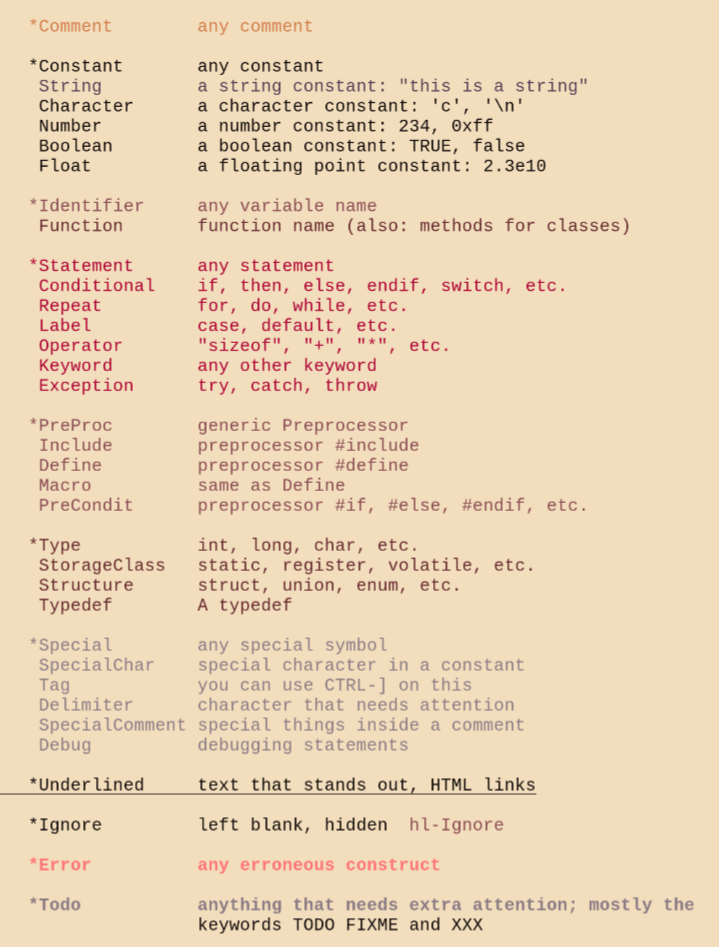
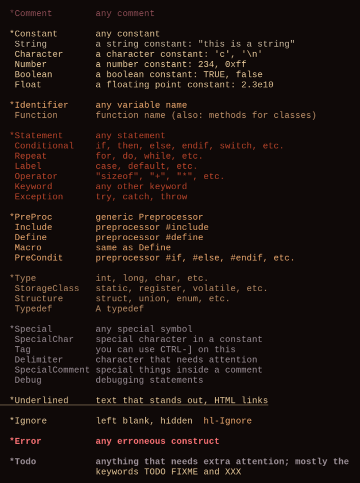

# Mellow

### A warm, minimalist colorscheme for (neo)vim

This colorscheme uses only 16 distinct colors for the dark or light theme.
It looks best with `termguicolors` enabled, but a fallback theme is also
provided if this option is not enabled (e.g. in the Linux vconsole).
It should work on Vim version 8 or later,
and supports additional highlight groups introduced in NeoVim 0.10.

This colorscheme is not affiliated with [mellow.nvim](https://github.com/mellow-theme/mellow.nvim).

Screenshots taken on alacritty with LiberationMono font:

    
    

For more screenshots, check the [wiki], or [vimcolorschemes.com](https://vimcolorschemes.com/adigitoleo/vim-mellow).

## Installation

Install the plugin using your preferred plugin manager. Alternatively, (Neo)Vim
can load packages if they are added to your 'packpath' (see `:help packages`).
Archives of tagged releases are available at
<https://github.com/adigitoleo/vim-mellow/tags>.

Otherwise, please add at least the `autoload`, `colors` and `doc` folders to
your (Neo)Vim package/runtime path (see `:help 'runtimepath'`).

After installing the colorscheme, please read `:help mellow` for information
on usage and available options. This includes an option to switch the fallback
color codes to ANSI mode instead of the default 256-color fallback palette.

Apply the colorscheme with `:colorscheme mellow`.

### Statusline integration

Two statusline plugins are currently supported:
- [Lightline] : set the Lightline colorscheme to `'mellow'`, requires
  `termguicolors` (I don't use this statusline, so please contribute patches or
  at least report an issue if the integration needs to be fixed)
- [mellow statusline] : my simple ASCII statusline, requires
  `let g:mellow_user_colors = 1`

## Miscellaneous

This theme was first motivated by a lack of `bg=light` option in [vim-farout],
which uses a similar minimalist set of warm red and yellow colors. I wanted a
light theme with moderate contrast and warm colors, that didn't make me want to
change every single syntax file. To me, Mellow lies mid-way between `:syntax
off` and popular themes like [solarized] or [gruvbox].

And that's just the way I like it :)

Since the theme uses only 16 colors, you can use the same colors in your
terminal of choice. Check the [wiki] for an example Alacritty theme, as well as
experimental Mellow colorschemes for some other Linux stuff.

[NOTE]: # ( ------------ PUT ALL EXTERNAL LINKS BELOW THIS LINE ------------ )

[wiki]: https://github.com/adigitoleo/vim-mellow/wiki

[vim-farout]: https://github.com/fcpg/vim-farout

[solarized]: https://en.wikipedia.org/wiki/Solarized_(color_scheme)

[gruvbox]: https://github.com/morhetz/gruvbox

[mellow statusline]: https://github.com/adigitoleo/vim-mellow-statusline

[Lightline]: https://github.com/itchyny/lightline.vim
