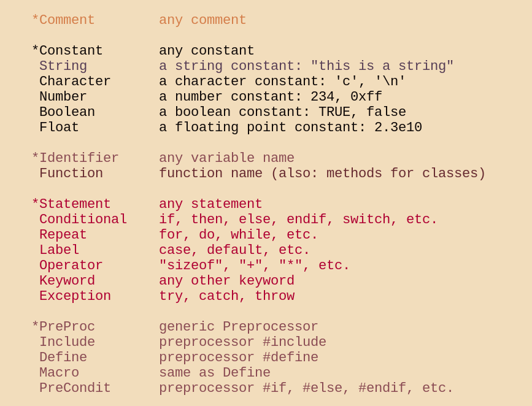
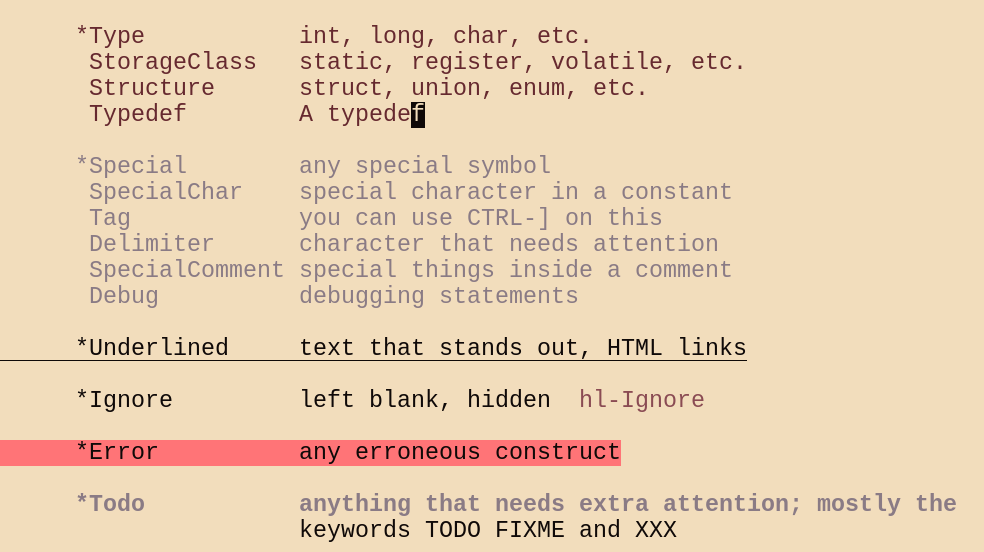
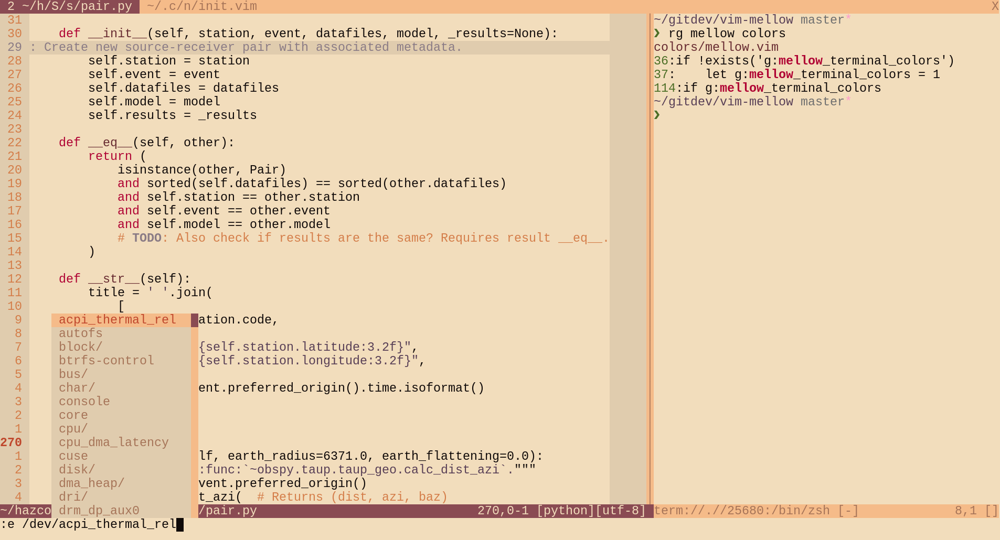

# Mellow

### A warm, minimalist light colorscheme for (neo)vim


`Plug 'adigitoleo/vim-mellow'`

**Note for terminal users:** This theme requires 24-bit RGB color support. If
your terminal is [compatible], enable RGB colors via `:set termguicolors`


<!-- vim-markdown-toc GFM -->

* [Screenshots](#screenshots)
* [Installation](#installation)
* [Usage](#usage)
* [Options](#options)
* [Customization](#customization)
* [Miscellaneous](#miscellaneous)

<!-- vim-markdown-toc -->


## Screenshots

Taken on alacritty with LiberationMono font:

<p align="middle">
    
    
</p>



*Do you want a statusline as well? Try the [mellow statusline]!*


## Installation

If you use a vim plugin manager (recommended), consult the relevant
documentation. Here are some links to popular plugin managers:
- [Pathogen]
- [NeoBundle]
- [Vundle]
- [vim-plug]

For manual installation, download the files from GitHub and put the `colors`
folder inside:
- `~/.vim/` (vim users)
- `~/.config/nvim/` (neovim users)


## Usage

*To apply commands at startup, add them to the end of your configuration file
(see `:help vimrc`).*

```vim
:set termguicolors
:colorscheme mellow
```

If it doesn't look right, it probably isn't. If you're sure you are running in
a [compatible] terminal, read `:help 'termguicolors'` and `:help
xterm-true-color` before opening an issue.

### Options

Use mellow color palette in the embedded terminal:
- enabled (`1`) by default if your (neo)vim has the terminal feature
- `:let g:mellow_terminal_colors = 0` to disable

### Customization

To make small changes to a colorscheme, use autocommands (see `:help autocmd`).
For example, to make line numbering use the normal background color:

```vim
augroup fix_colors
    autocmd!
    autocmd ColorScheme mellow hi LineNr guibg=None
    autocmd ColorScheme mellow hi CursorLineNr guibg=None
augroup END
```

## Miscellaneous

This theme was first motivated by a lack of `bg=light` option in [vim-farout],
which uses a similar palette in a completely different arrangement. I wanted a
light theme with moderate contrast and warm colors, that didn't make me want to
change every single syntax file. To me, mellow lies mid-way between `:syntax
off` and popular themes like [solarized] or [gruvbox].

And that's just the way I like it :)

Some more links, for your convenience:
- [RGB mellow palette]
- [mellow statusline]

*Stay tuned for mellow's fellows (i3wm, rofi, ...)*


[NOTE]: # ( ------------ PUT ALL EXTERNAL LINKS BELOW THIS LINE ------------ )

[compatible]: https://gist.github.com/XVilka/8346728

[Pathogen]: https://github.com/tpope/vim-pathogen

[NeoBundle]: https://github.com/Shougo/neobundle.vim

[Vundle]: https://github.com/gmarik/vundle

[vim-plug]: https://github.com/junegunn/vim-plug

[vim-farout]: https://github.com/fcpg/vim-farout

[solarized]: https://en.wikipedia.org/wiki/Solarized_(color_scheme)

[gruvbox]: https://github.com/morhetz/gruvbox

[RGB mellow palette]: https://colourco.de/freebuild/e0ccae-f2ddbc-0f0908-291916-af0032-ff7477-4c6e25-84bf40-a67458-f5bb89-573e55-8a7b85-66292f-8a4b53-bf472c-d47d49

[mellow statusline]: https://github.com/adigitoleo/vim-mellow-statusline
