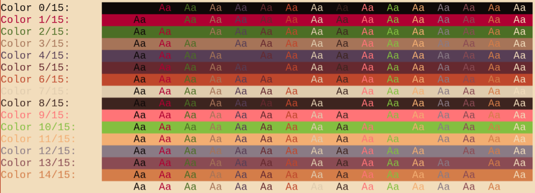

# Mellow


### A warm, minimalist colorscheme for (neo)vim

`Plug 'adigitoleo/vim-mellow, { 'tag': '*' }`

<!-- vim-markdown-toc GFM -->

* [Screenshots](#screenshots)
* [Light theme](#light-theme)
* [Dark theme](#dark-theme)
* [Installation](#installation)
* [Usage](#usage)
* [Options](#options)
* [Customization](#customization)
* [Miscellaneous](#miscellaneous)

<!-- vim-markdown-toc -->


## Screenshots

Taken on alacritty with LiberationMono font:

<p align="center" style="margin: 4%;">
    
    
</p>


### Light theme




### Dark theme


## Installation

It is recommended to install a tagged release. The master branch is not
guaranteed to be stable.

If you use a vim plugin manager (recommended), consult the relevant
documentation. Here are some links to popular plugin managers:
- [Pathogen]
- [NeoBundle]
- [Vundle]
- [vim-plug]

For manual installation, download the files of the latest GitHub release and
put the `colors` folder inside:
- `~/.vim/` (vim users)
- `~/.config/nvim/` (neovim users)


## Usage

*To apply commands at startup, add them to the end of your configuration file
(see `:help vimrc`).*

You can omit the `termguicolors` part if you are running (neo)vim in a GUI, or
if you have set `g:mellow_cterm_ansi = 1`.

```vim
:set termguicolors
:colorscheme mellow
```

The colorscheme works for both `background=light` and `background=dark`
according to the screenshots above. See `:help 'background'`.

Two statusline plugins are currently supported:
- [Lightline]
- [mellow statusline]

If it doesn't look right, you might not have a truecolor [compatible] terminal.
It might be worth reading `:help 'termguicolors'` and `:help xterm-true-color`
before opening an issue.


### Options

**Use Mellow color palette in the embedded terminal:**
- enabled (`1`) by default if your (neo)vim has the terminal feature
- `:let g:mellow_terminal_colors = 0` to disable

*NOTE: Colors in existing `:terminal` buffers are NOT re-drawn when
changing `set background`. You will need to kill and restart any `:terminal`s
to see the new colors.*

**Define optional `User1..9` groups using Mellow colors:**
- disabled (`0`) by default
- `:let g:mellow_user_colors = 1` to enable

**Use the first 16 terminal colors as the `cterm{bg,fg}` fallback colors:**
- `:let g:mellow_cterm_ansi = 1` to enable
- uses [16,256] color codes for the fallback colors by default (`0`)

*NOTE: The default fallback colorschemes are rudimentary and intended for
debugging purposes only.*


### Customization

To make small changes to a colorscheme, use autocommands (see `:help autocmd`).
For example, to make line numbering use the normal background color:

```vim
augroup fix_colors
    autocmd!
    autocmd ColorScheme mellow hi LineNr guibg=None
    autocmd ColorScheme mellow hi CursorLineNr guibg=None
augroup END
```

If you use [ALE], you might prefer stronger highlights for warnings/errors:

```vim
augroup ale_highlights
    au!
    autocmd ColorScheme mellow hi link ALEWarning Visual
    autocmd ColorScheme mellow hi link ALEErrorLine DiffDelete
augroup END
```


## Miscellaneous

This theme was first motivated by a lack of `bg=light` option in [vim-farout],
which uses a similar minimalist set of warm red and yellow colors. I wanted a
light theme with moderate contrast and warm colors, that didn't make me want to
change every single syntax file. To me, Mellow lies mid-way between `:syntax
off` and popular themes like [solarized] or [gruvbox].

And that's just the way I like it :)

Since the theme uses only 16 colors, you can use the same colors in your
terminal of choice. Check the [wiki] for an example Alacritty theme, as well as
experimental Mellow colorschemes for some other Linux stuff.

Some more links, for your convenience:
- [RGB mellow palette (bg=light)]
- [RGB mellow palette (bg=dark)]
- [mellow statusline]


[NOTE]: # ( ------------ PUT ALL EXTERNAL LINKS BELOW THIS LINE ------------ )

[wiki]: https://github.com/adigitoleo/vim-mellow/wiki

[compatible]: https://gist.github.com/XVilka/8346728

[Pathogen]: https://github.com/tpope/vim-pathogen

[NeoBundle]: https://github.com/Shougo/neobundle.vim

[Vundle]: https://github.com/gmarik/vundle

[vim-plug]: https://github.com/junegunn/vim-plug

[vim-farout]: https://github.com/fcpg/vim-farout

[solarized]: https://en.wikipedia.org/wiki/Solarized_(color_scheme)

[gruvbox]: https://github.com/morhetz/gruvbox

[RGB mellow palette (bg=light)]: https://colourco.de/freebuild/e0ccae-f2ddbc-0f0908-3d241f-af0032-ff7477-4c6e25-84bf40-a67458-f5bb89-573e55-8a7b85-66292f-8a4b53-bf472c-d47d49

[RGB mellow palette (bg=dark)]: https://colourco.de/freebuild/d3c1a6-eccd9d-0f0908-3d241f-af0032-ff7477-577e2a-84bf40-bf9169-f5bb89-896186-9f939b-66292f-8a4b53-bf472c-d47d49

[mellow statusline]: https://github.com/adigitoleo/vim-mellow-statusline

[ALE]: https://github.com/dense-analysis/ale

[Lightline]: https://github.com/itchyny/lightline.vim
